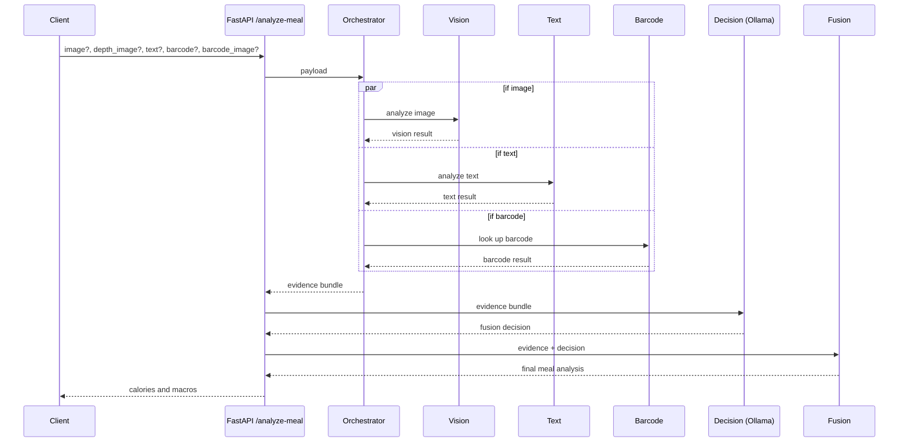
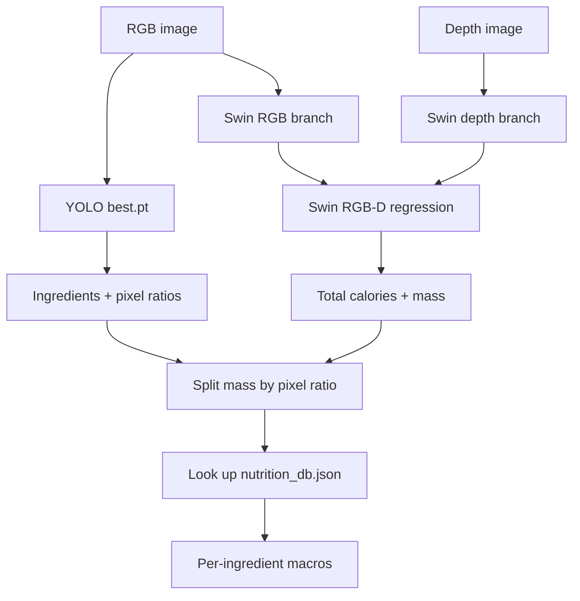
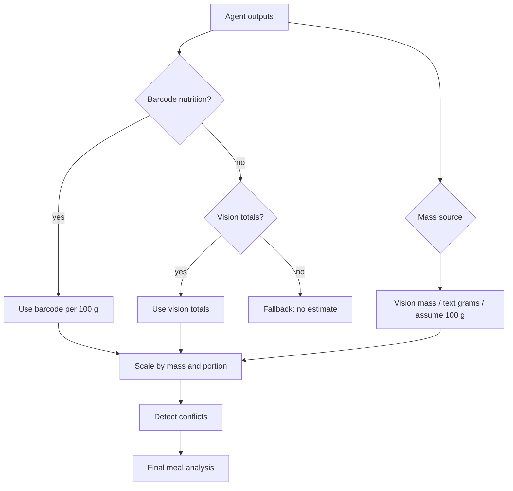

# Nutri Fusion Agent

Multimodal meal-analysis backend. Give it a meal photo (optionally with a depth image), a text description, and/or a barcode, and it returns one fused calorie and macronutrient estimate.

## Quick Start

Requires Python 3.13 (tested) and git.

```bash
# 1. Clone
git clone https://github.com/isenel0/nutri_fusion_agent.git
cd nutri_fusion_agent

# 2. Create a virtual environment and install dependencies
python3 -m venv .venv
source .venv/bin/activate          # Windows: .venv\Scripts\activate
python -m pip install -r requirements.txt

# 3. Download the model weights (~730 MB) from Hugging Face
python download_models.py

# 4. Start the API
python -m uvicorn main:app --app-dir src
```

The API is now at http://127.0.0.1:8000. Open http://127.0.0.1:8000/docs to try it in the browser.

Optional extras:

- **Barcode photos** need the zbar library: `brew install zbar` (macOS) or `sudo apt install libzbar0` (Linux). Typed barcode numbers work without it.
- **LLM fusion decisions** use a local [Ollama](https://ollama.com) model. Without it, the system falls back to deterministic rules.
  ```bash
  ollama serve
  ollama pull qwen3.5:9b
  ```

### Desktop GUI

```bash
python src/gui_app.py      # full multimodal GUI
python src/vision_gui.py   # vision-only GUI
```

### Docker

A prebuilt image with all model weights is on Docker Hub: [`irfansenel/nutri-fusion-agent`](https://hub.docker.com/r/irfansenel/nutri-fusion-agent). No clone or model download needed:

```bash
docker run --rm -p 8000:8000 irfansenel/nutri-fusion-agent:latest
```

The published image is built for `linux/arm64` (Apple Silicon, ARM servers). On Intel/AMD machines, build it yourself instead. Run `python download_models.py` first, since the image bundles the weights:

```bash
docker build -t nutri-fusion-agent .
docker run --rm -p 8000:8000 nutri-fusion-agent
```

The container reaches Ollama on the host through `host.docker.internal:11434`.

## Usage

`POST /analyze-meal` accepts multipart form fields. All are optional, but at least one of `image`, `text`, `barcode` or `barcode_image` is required.

| Field           | Description                                          |
|-----------------|------------------------------------------------------|
| `image`         | RGB meal photo                                       |
| `depth_image`   | Depth image matching `image` (enables calorie/mass)  |
| `text`          | Meal description, e.g. `half portion chicken rice`   |
| `barcode`       | Barcode number of a packaged product                 |
| `barcode_image` | Photo of a barcode                                   |

```bash
curl -X POST http://127.0.0.1:8000/analyze-meal \
  -F "image=@rgb.png" \
  -F "depth_image=@depth_color.png" \
  -F "text=half portion grilled chicken with rice"
```

The response contains `final_macros` (calories, mass, protein, carbs, fat), the per-item breakdown, which source was used, and any conflicts between inputs.

## How It Works

1. **Orchestrator** runs the agents for whichever inputs were provided, in parallel.
2. **Vision agent**: YOLO (`best.pt`) segments the food and finds ingredients. With a depth image, a Swin RGB-D model (`Swin.pth`) predicts total calories and mass, which are split across ingredients by pixel ratio. Macros come from the Nutrition5k nutrition database.
3. **Text agent**: a BERT model extracts foods, quantities, units, cooking methods and portion hints (e.g. "half" → 0.5×).
4. **Barcode agent**: reads the barcode and fetches nutrition per 100 g from OpenFoodFacts.
5. **Decision agent** (optional, Ollama) chooses which fusion rules to apply.
6. **Fusion agent** combines everything: barcode nutrition wins for packaged food, otherwise vision totals, then scales by mass and portion and flags conflicts.

## Project Structure

```text
src/
  main.py                FastAPI app
  gui_app.py             Desktop GUI
  schemas.py, config.py  Shared data contracts and settings
  agents/
    orchestrator/        Runs the modality agents
    vision/              YOLO + Swin pipeline (best.pt, Swin.pth)
    text/                BERT text model (model.safetensors)
    barcode/             Barcode scanning + OpenFoodFacts client
    decision/            Ollama-based fusion decision
    fusion/              Final deterministic fusion
    food/                Food name resolution
nutrition5k/metadata/nutrition_db.json   Per-gram nutrition priors
scripts/evaluate_dataset.py              Evaluation over the test set
download_models.py                       Fetches model weights
```

Model weights are hosted at [huggingface.co/kingkuntairfan/nutri-fusion](https://huggingface.co/kingkuntairfan/nutri-fusion). The Docker image is at [hub.docker.com/r/irfansenel/nutri-fusion-agent](https://hub.docker.com/r/irfansenel/nutri-fusion-agent).

## Diagrams

### Request flow



### Vision pipeline



### Fusion rules


