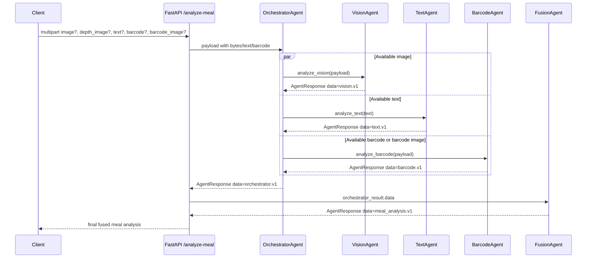
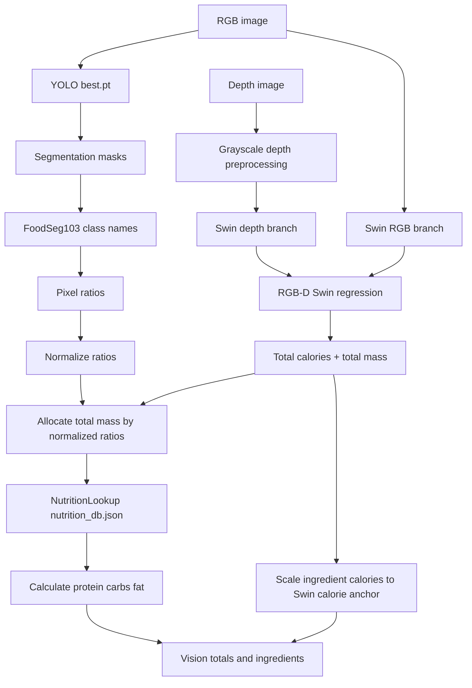
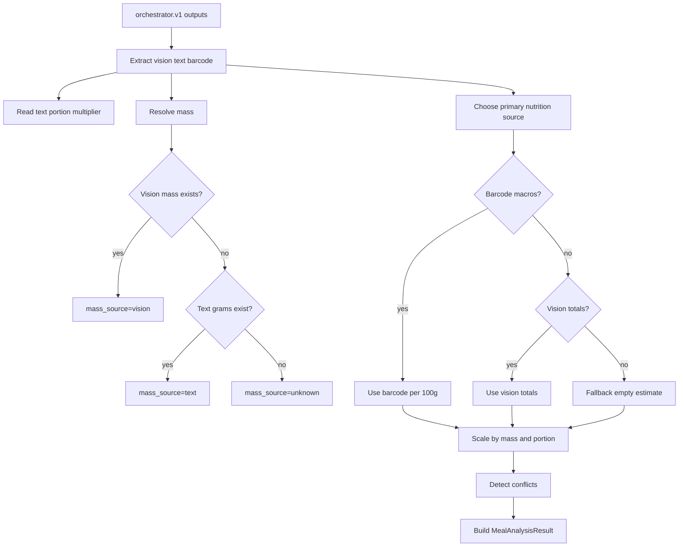

# Nutri Fusion Agent

Nutri Fusion Agent is a multimodal meal-analysis backend. It accepts meal images, optional depth images, free-form text, barcode text, and barcode images. The system converts each available modality into a structured agent contract, then deterministically fuses those contracts into one final meal nutrition estimate.

This README is written as a source document for NotebookLM or other diagramming assistants. It explains the system boundaries, schemas, workflow order, model responsibilities, and fusion rules in enough detail to create a complete workflow diagram.

## System Goal

The system estimates meal calories and macronutrients from multiple evidence sources:

- Vision evidence: visible ingredients, pixel ratios, optional total mass and calories from RGB-D inference.
- Text evidence: user-provided food names, quantities, units, cooking methods, modifiers, and portion hints.
- Barcode evidence: packaged-food identity and nutrition per 100g from OpenFoodFacts.
- Fusion evidence: deterministic rules that choose the most reliable nutrition source and scale it by mass or portion.

The central invariant is that every agent returns an `AgentResponse`. The final API response is also an `AgentResponse` whose `data` field contains a `MealAnalysisResult`.

## Top-Level Architecture

```text
Client
  |
  | POST /analyze-meal
  | image?, depth_image?, text?, barcode?, barcode_image?
  v
FastAPI app: src/main.py
  |
  v
OrchestratorAgent
  |
  | Runs available modality tools concurrently
  |
  +--> VisionAgent       -> contract: vision.v1
  +--> TextAgent         -> contract: text.v1
  +--> BarcodeAgent      -> contract: barcode.v1
  |
  v
OrchestratorAgentData    -> contract: orchestrator.v1
  |
  v
FusionAgent
  |
  | Applies deterministic nutrition, mass, portion, and conflict rules
  v
MealAnalysisResult       -> contract: meal_analysis.v1
  |
  v
AgentResponse(source="fusion")
```

## Runtime Entry Points

### FastAPI API

Run the API:

```bash
python -m venv .venv
source .venv/bin/activate
pip install -r requirements.txt
uvicorn main:app --app-dir src --reload
```

The API uses Ollama for the optional LLM fusion decision layer. By default it
calls `qwen3.5:9b`:

```bash
ollama serve
ollama pull qwen3.5:9b
export OLLAMA_FUSION_MODEL=qwen3.5:9b
```

If Ollama is unavailable or times out, the system falls back to deterministic
fusion rules.

Health check:

```bash
curl http://127.0.0.1:8000/health
```

Analyze a meal:

```bash
curl -X POST http://127.0.0.1:8000/analyze-meal \
  -F "image=@/path/to/rgb.png" \
  -F "depth_image=@/path/to/depth_color.png" \
  -F "text=half portion grilled chicken with rice" \
  -F "barcode=5449000000996"
```

### Focused Vision GUI

Run the vision-only desktop GUI:

```bash
python src/vision_gui.py
```

The GUI is useful for testing the corrected intended vision design:

- RGB image only: runs segmentation-only mode and returns visible ingredients plus pixel ratios.
- RGB image plus depth image: runs full late-fusion mode.
- Full late-fusion mode uses Swin for total calories and mass, YOLO for ingredients and pixel ratios, and the Nutrition5K nutrition database for protein, carbs, and fat.

## Repository Layout

```text
src/
  main.py                         FastAPI entrypoint.
  schemas.py                      Shared Pydantic contracts.
  config.py                       Environment-driven settings.
  gui_app.py                      General multimodal desktop GUI.
  vision_gui.py                   Focused GUI for vision-agent testing.

  agents/
    base_agent.py                 Base async agent interface.

    orchestrator/
      agent.py                    Runs available modality tools and packages evidence.
      tools.py                    Framework-neutral wrappers around Vision/Text/Barcode agents.

    decision/
      agent.py                    LangChain + Ollama fusion-decision agent.
      prompts.py                  Local LLM prompt for choosing fusion rules.

    vision/
      agent.py                    API-facing vision contract wrapper.
      unified_vision_agent.py     YOLO + Swin + Nutrition5K macro calculation.
      nutrition_lookup.py         FoodSeg label to Nutrition5K macro-prior lookup.
      class_mapping.py            FoodSeg103 class-id to human-readable class names.
      best.pt                     YOLO segmentation weights.
      food101_pretrained_model_SwinV1-99acc-10epochfinetune.pth
                                    Swin RGB-D checkpoint used for total calories and mass.
      training.py                 Older/local training utilities.
      mask_cache.py               Utility for generating cached food masks.

    text/
      agent.py                    Local BERT token-classification text agent.
      model.safetensors           Local NER model weights.
      label_map.json              Text labels.
      tokenizer files             Local tokenizer/config files.

    barcode/
      agent.py                    Barcode normalization, image decode, and product lookup.
      service.py                  Barcode image scanner.
      openfoodfacts_client.py     OpenFoodFacts HTTP client and response normalization.

    fusion/
      agent.py                    Deterministic final fusion and macro scaling.

nutrition5k/
  metadata/
    nutrition_db.json             Per-gram and per-100g nutrition priors.
    normalized/dishes_training.csv
    normalized/dish_ingredients_training.csv

artifacts/
  segmentation_runs/              Segmentation evaluation outputs.
```

## API Workflow

The endpoint is `POST /analyze-meal` in `src/main.py`.

Accepted multipart fields:

- `image`: optional RGB meal image.
- `depth_image`: optional depth image paired with the RGB image.
- `barcode_image`: optional image containing a barcode.
- `text`: optional free-form meal description.
- `barcode`: optional explicit barcode string.

Validation rule:

- At least one of `image`, `barcode_image`, `text`, or `barcode` must be provided.
- `depth_image` alone is not enough; it is only useful with `image`.

Main endpoint sequence:

```text
1. FastAPI receives multipart input.
2. Uploaded files are read into bytes.
3. A payload dictionary is built:
   - text
   - barcode
   - image_bytes, image_filename, image_content_type
   - depth_bytes, depth_image_filename
   - barcode_image_bytes, barcode_image_filename
4. OrchestratorAgent.process(payload) runs.
5. FusionAgent.process(orchestrator_result.data) runs.
6. The endpoint returns the FusionAgent AgentResponse.
```

## Universal Agent Envelope

Every agent returns:

```python
AgentResponse:
  source: str
  confidence: float       # 0.0 to 1.0
  data: dict              # agent-specific contract
  error: str | None
```

The `data.contract_version` field identifies the inner schema:

- `vision.v1`
- `text.v1`
- `barcode.v1`
- `orchestrator.v1`
- `meal_analysis.v1`

## Orchestrator Workflow

Implementation: `src/agents/orchestrator/agent.py`

The orchestrator does not calculate final nutrition. It only detects available inputs, runs the relevant modality tools concurrently, and returns an evidence bundle.

Input availability detection:

```text
image_provided:
  image_path OR image_bytes OR bytes

depth_image_provided:
  depth_path OR depth_bytes

text_provided:
  text

barcode_text_provided:
  barcode

barcode_image_provided:
  barcode_image_path OR barcode_image_bytes
```

Tool dispatch:

```text
If image_provided:
  run analyze_vision(payload)

If text_provided:
  run analyze_text({"text": text})

If barcode_text_provided OR barcode_image_provided:
  run analyze_barcode(payload)
```

Concurrency model:

- The orchestrator creates one asyncio task per available modality.
- Tasks are gathered with `return_exceptions=True`.
- A failed modality becomes an `AgentResponse` with `confidence=0.0` and an error message.
- Other modality outputs can still be fused.

Orchestrator output contract:

```python
OrchestratorAgentData:
  contract_version: "orchestrator.v1"
  agent: "orchestrator"
  input: OrchestratorInputSummary
  tool_order: list[str]
  outputs:
    vision: AgentResponse | None
    text: AgentResponse | None
    barcode: AgentResponse | None
  errors: dict[str, str]
  llm_context: dict
  llm_notes: list[str]
```

The `llm_context` field is a compact summary for future LLM reasoning. Current final fusion is deterministic.

## Vision Agent Workflow

Implementation:

- API wrapper: `src/agents/vision/agent.py`
- Model pipeline: `src/agents/vision/unified_vision_agent.py`
- Nutrition priors: `src/agents/vision/nutrition_lookup.py`

The vision agent has two modes.

### Vision Mode 1: Segmentation Only

Triggered when an RGB image is provided but no depth image is provided.

Workflow:

```text
RGB image
  |
  v
YOLO model: best.pt
  |
  v
Segmentation masks + class ids
  |
  v
FoodSeg103 class names
  |
  v
Detected items with pixel ratios
```

Segmentation-only output includes:

- `mode="segmentation_only"`
- `detected_items`
- `missing_requirements=["depth_image_for_late_fusion"]`
- no total calories
- no total mass
- no macro estimate

Important meaning:

- Pixel ratios are image-area ratios.
- Pixel ratios are not grams.
- Without depth or another mass source, the vision agent does not convert ratios into nutrition.

### Vision Mode 2: Late Fusion

Triggered when both RGB image and depth image are provided.

Correct intended design:

```text
RGB image
  |
  +--------------------------+
  |                          |
  v                          v
YOLO segmentation            Swin RGB-D regression
best.pt                      food101_pretrained_model_SwinV1...
  |                          |
  v                          v
ingredients + pixel ratios   total_calories_kcal + total_mass_g
  |                          |
  +-------------+------------+
                |
                v
Normalize pixel ratios
                |
                v
Allocate mass by normalized ratio
                |
                v
NutritionLookup against nutrition5k/metadata/nutrition_db.json
                |
                v
Calculate protein_g, carbs_g, fat_g per ingredient
                |
                v
Scale ingredient calories to the Swin total-calorie anchor
                |
                v
Vision totals + per-ingredient estimates
```

The Swin checkpoint still has five output neurons, but the Colab fine-tuning script optimized only the first two outputs:

```python
outputs_subset = outputs[:, :2]
targets_subset = targets[:, :2]
```

Therefore runtime treats the Swin model as a two-target regressor:

- `output[0]`: total calories in kcal
- `output[1]`: total mass in grams

Runtime ignores raw Swin outputs 2, 3, and 4. Protein, carbs, and fat are calculated from ingredient nutrition priors instead.

Depth image note:

- The training notebook used `depth_color.png` and converted it to grayscale.
- Runtime also loads depth with `Image.open(depth_path).convert("L")`.
- For this checkpoint, a depth-color image converted to grayscale is consistent with training.

Vision late-fusion math:

```text
raw_pixel_ratio_i = food_mask_pixels_i / total_food_mask_pixels
normalized_ratio_i = raw_pixel_ratio_i / sum(raw_pixel_ratios)
ingredient_mass_g_i = swin_total_mass_g * normalized_ratio_i
ingredient_fat_g_i = ingredient_mass_g_i * nutrition_prior.fat_per_g
ingredient_carbs_g_i = ingredient_mass_g_i * nutrition_prior.carbs_per_g
ingredient_protein_g_i = ingredient_mass_g_i * nutrition_prior.protein_per_g
db_calories_i = ingredient_mass_g_i * nutrition_prior.calories_per_g
calorie_scale = swin_total_calories_kcal / sum(db_calories_i)
ingredient_calories_kcal_i = db_calories_i * calorie_scale
```

Vision totals:

```text
total_calories_kcal = Swin total calorie anchor
total_mass_g = Swin total mass
total_fat_g = sum(ingredient_fat_g_i)
total_carbs_g = sum(ingredient_carbs_g_i)
total_protein_g = sum(ingredient_protein_g_i)
```

Vision output contract:

```python
VisionAgentData:
  contract_version: "vision.v1"
  agent: "vision"
  mode: "segmentation_only" | "late_fusion"
  input:
    image_provided: bool
    depth_provided: bool
  models:
    segmentation_model: str
    nutrition_model: str | None
    fusion_strategy: "segmentation_only" | "late_fusion"
  detected_items:
    - name: str
      pixel_ratio: float
  totals:
    calories_kcal: float | None
    mass_g: float | None
    protein_g: float | None
    carbs_g: float | None
    fat_g: float | None
  ingredients:
    - name: str
      pixel_ratio: float
      normalized_ratio: float
      nutrition:
        calories_kcal: float
        mass_g: float
        protein_g: float
        carbs_g: float
        fat_g: float
  ratio_summary:
    raw_ratio_sum: float
    normalized_ratio_sum: float
    db_calories_before_scaling_kcal: float
    swin_calorie_anchor_kcal: float
    ingredient_calorie_scale: float
    nutrition_prior_match_ratio: float
  llm_notes: list[str]
  missing_requirements: list[str]
```

## Nutrition Lookup Workflow

Implementation: `src/agents/vision/nutrition_lookup.py`

Input:

- FoodSeg-style label, for example `chicken duck`, `rice`, `cheese butter`.

Data source:

- `nutrition5k/metadata/nutrition_db.json`

Output:

```python
NutritionPrior:
  source_name: str
  calories_per_g: float
  fat_per_g: float
  carbs_per_g: float
  protein_per_g: float
  matched: bool
```

Resolution strategy:

```text
1. Normalize label: lowercase, replace underscores, trim duplicate spaces.
2. Check explicit alias table.
3. If alias maps to a tuple, average the matched priors.
   Example: "chicken duck" -> average("chicken", "duck")
4. If no alias, try exact nutrition_db key.
5. If no exact key, try fuzzy match with cutoff 0.88.
6. If still no match, use DEFAULT_PRIOR:
   generic mixed food = 2.0 kcal/g, 0.08 fat/g, 0.18 carbs/g, 0.08 protein/g.
```

Current FoodSeg103 coverage is high; most labels map directly, by alias, or by fuzzy matching. Labels such as `other ingredients` intentionally fall back to a generic prior.

## Text Agent Workflow

Implementation: `src/agents/text/agent.py`

Purpose:

- Extract structured meal context from free-form user text.
- Provide portion modifiers and mass hints to fusion.
- Provide human-described food names to detect conflicts with vision or barcode evidence.

Model:

- Local BERT token-classification model.
- Loaded from `src/agents/text/`.
- Uses Hugging Face `transformers` with `local_files_only=True`.

Recognized entity types:

- `food`
- `quantity`
- `unit`
- `method`
- `modifier`

Workflow:

```text
Raw text
  |
  v
Normalize input
  |
  v
Local token-classification pipeline
  |
  v
Extract FOOD / QUANTITY / UNIT / METHOD / MODIFIER entities
  |
  v
Keyword augmentation
  |
  v
Deduplicate entities
  |
  v
Infer portion multiplier
```

Keyword augmentation:

- Cooking methods: `grilled`, `fried`, `boiled`, `baked`, `roasted`, `raw`, `ızgara`, `kızarmış`, `haşlanmış`.
- Quantity hints: `half`, `quarter`, `double`, `1/2`, `1/4`, `yarım`, `çeyrek`.
- Food phrase hints: `olive oil`, `zeytinyağı`.

Portion multiplier rules:

```text
"half", "1/2", "yarım"       -> 0.5
"quarter", "1/4", "çeyrek"  -> 0.25
"double", "2x", "iki porsiyon" -> 2.0
otherwise                    -> None
```

Text output contract:

```python
TextAgentData:
  contract_version: "text.v1"
  agent: "text"
  input:
    raw_text: str
  model:
    model_path: str
    architecture: "BertForTokenClassification"
    labels: list[str]
  entities:
    - type: "food" | "quantity" | "unit" | "method" | "modifier"
      text: str
      confidence: float
      start_char: int | None
      end_char: int | None
  parsed:
    foods: list[str]
    quantities: list[str]
    units: list[str]
    methods: list[str]
    modifiers: list[str]
    portion_multiplier: float | None
  llm_notes: list[str]
  missing_requirements: list[str]
```

## Barcode Agent Workflow

Implementation:

- `src/agents/barcode/agent.py`
- `src/agents/barcode/service.py`
- `src/agents/barcode/openfoodfacts_client.py`

Purpose:

- Resolve barcode text from explicit barcode input or barcode image.
- Fetch packaged-food nutrition from OpenFoodFacts.
- Normalize provider-specific fields into project nutrition schema.

Supported inputs:

- String barcode, for example `"5449000000996"`.
- Dict payload with `barcode`.
- Dict payload with `image_path`.
- Dict payload with `image_bytes` or `bytes`.

Workflow:

```text
Barcode text or barcode image
  |
  v
Normalize explicit barcode if present
  |
  +--> If no explicit barcode: scan barcode image
  |
  v
Validate barcode format
  |
  v
GET OpenFoodFacts /product/{barcode}.json
  |
  v
Normalize OpenFoodFacts nutriments into nutrition_per_100g
```

Barcode format rule:

```text
^[A-Za-z0-9]{3,30}$
```

OpenFoodFacts fields:

```text
energy-kcal_100g or energy-kcal_value -> calories_kcal
proteins_100g                         -> protein_g
carbohydrates_100g                    -> carbs_g
fat_100g                              -> fat_g
fiber_100g                            -> fiber_g
sugars_100g                           -> sugar_g
sodium_100g                           -> sodium_g
```

Barcode confidence rules:

- Product found with any macro: `barcode_confidence_with_macros`, default `0.95`.
- Barcode found but macros missing or lookup failed: `barcode_confidence_without_macros`, default `0.75`.
- Input error or no barcode: `barcode_confidence_on_error`, default `0.0`.

Barcode output contract:

```python
BarcodeAgentData:
  contract_version: "barcode.v1"
  agent: "barcode"
  input:
    barcode_text: str | None
    image_filename: str | None
  barcode:
    value: str
    type: str | None
  product:
    name: str | None
    brand: str | None
    categories: str | None
    quantity: str | None
    serving_size: str | None
  nutrition_per_100g:
    calories_kcal: float | None
    mass_g: float | None
    protein_g: float | None
    carbs_g: float | None
    fat_g: float | None
    fiber_g: float | None
    sugar_g: float | None
    sodium_g: float | None
  source:
    provider: "openfoodfacts"
    fetched_barcode: str | None
  llm_notes: list[str]
  raw_product: dict | None
```

## Fusion Agent Workflow

Implementation: `src/agents/fusion/agent.py`

The fusion agent is deterministic. It does not call an LLM. It consumes either:

- an `orchestrator.v1` evidence bundle, or
- a dict with direct `vision`, `text`, and `barcode` outputs.

High-level fusion sequence:

```text
Orchestrator outputs
  |
  v
Extract vision/text/barcode AgentResponses
  |
  v
Read text portion multiplier
  |
  v
Resolve mass:
  1. vision totals.mass_g
  2. text grams mention
  3. unknown
  |
  v
Choose primary nutrition source:
  1. barcode nutrition_per_100g if available
  2. vision totals if available
  3. fallback if neither has numeric macros
  |
  v
Scale nutrition by mass and portion
  |
  v
Detect conflicts
  |
  v
Build final items and MealAnalysisResult
```

Primary nutrition source rules:

```text
If barcode has any calories/protein/carbs/fat:
  primary_nutrition_source = "barcode"
  final_macros = barcode nutrition_per_100g scaled by resolved grams
  if no mass is available:
    assume 100g serving

Else if vision totals have any calories/protein/carbs/fat:
  primary_nutrition_source = "vision"
  final_macros = vision totals scaled by text portion multiplier

Else:
  primary_nutrition_source = "fallback"
  final_macros = empty NutritionEstimate
  warning = no numeric nutrition estimate available
```

Mass source rules:

```text
If vision totals.mass_g exists:
  mass_source = "vision"

Else if text contains a gram amount:
  mass_source = "text"

Else if barcode is primary and no mass exists:
  mass_source = "assumed_100g"
  mass_g = 100.0

Else:
  mass_source = "unknown"
```

Text gram parsing:

- Fusion searches the joined text quantities and units for:

```text
(\d+(?:\.\d+)?)\s*(g|gram|grams)
```

Conflict rules:

```text
If text foods and vision detected items exist and do not overlap:
  conflict = "text_foods_do_not_overlap_vision_detected_items"

If barcode product name exists and vision foods exist:
  conflict = "barcode_product_and_vision_food_may_refer_to_different_sources"
```

Final output contract:

```python
MealAnalysisResult:
  contract_version: "meal_analysis.v1"
  agent: "fusion"
  meal_name: str | None
  final_macros: NutritionEstimate
  items:
    - name: str
      source: "vision" | "barcode" | "text" | "fallback"
      mass_g: float | None
      nutrition: NutritionEstimate
      confidence: float
      notes: list[str]
  fusion_decision:
    primary_nutrition_source: "barcode" | "vision" | "fallback"
    mass_source: "vision" | "text" | "assumed_100g" | "unknown"
    portion_multiplier: float
    applied_rules: list[str]
    conflicts: list[str]
    assumptions: list[str]
  inputs_used:
    vision: bool
    text: bool
    barcode: bool
  confidence: float
  reasoning_summary: str
  warnings: list[str]
  agent_outputs:
    vision: AgentResponse | None
    text: AgentResponse | None
    barcode: AgentResponse | None
```

Fusion confidence:

- Average confidence of all non-error available modality outputs.
- If no successful modalities exist, confidence is `0.0`.

## Shared Nutrition Schema

`NutritionEstimate` appears in vision, barcode, and final fusion outputs.

```python
NutritionEstimate:
  calories_kcal: float | None
  mass_g: float | None
  protein_g: float | None
  carbs_g: float | None
  fat_g: float | None
  fiber_g: float | None
  sugar_g: float | None
  sodium_g: float | None
```

Meaning by context:

- Barcode: values are per 100g.
- Vision totals: values are total meal estimates.
- Vision ingredients: values are per detected ingredient estimate.
- Fusion final_macros: values are final scaled meal estimate.

## Example Full Workflow

Example input:

```text
image = overhead RGB meal image
depth_image = matching depth_color image
text = "half portion grilled chicken with rice"
barcode = none
barcode_image = none
```

Expected flow:

```text
1. FastAPI reads image and depth bytes plus text.
2. Orchestrator sees image_provided=True, depth_image_provided=True, text_provided=True.
3. Orchestrator concurrently runs:
   - VisionAgent
   - TextAgent
4. VisionAgent runs late_fusion:
   - YOLO detects classes such as chicken duck and rice.
   - YOLO computes pixel ratios.
   - Swin predicts total calories and mass.
   - NutritionLookup maps classes to per-gram priors.
   - Vision calculates protein/carbs/fat from mass and priors.
5. TextAgent extracts:
   - food entities, such as chicken and rice.
   - method entity, such as grilled.
   - quantity entity, such as half.
   - portion_multiplier=0.5.
6. Orchestrator returns an evidence bundle.
7. FusionAgent chooses vision as primary nutrition source because no barcode macros exist.
8. FusionAgent scales vision totals by 0.5.
9. FusionAgent returns final AgentResponse(source="fusion").
```

## Example Barcode-Dominant Workflow

Example input:

```text
barcode = "5449000000996"
text = "200g"
```

Expected flow:

```text
1. Orchestrator runs BarcodeAgent and TextAgent.
2. BarcodeAgent fetches OpenFoodFacts nutrition_per_100g.
3. TextAgent extracts quantity/unit context.
4. FusionAgent uses barcode as primary nutrition source.
5. FusionAgent resolves mass from text as 200g.
6. FusionAgent scales barcode nutrition_per_100g by 2.0.
7. Final output contains packaged-food macros for 200g.
```

## Example Vision-Only Without Depth

Example input:

```text
image = overhead RGB meal image
depth_image = none
```

Expected flow:

```text
1. VisionAgent runs segmentation_only.
2. Output contains detected_items and pixel_ratio values.
3. Output contains missing_requirements=["depth_image_for_late_fusion"].
4. FusionAgent cannot compute numeric macros from segmentation-only vision.
5. Final output is fallback unless another modality provides nutrition.
```

## Mermaid Sequence Diagram

This Mermaid diagram can be copied into diagram tools:



## Mermaid Vision Detail Diagram



## Mermaid Fusion Detail Diagram



## Configuration

Settings are in `src/config.py` and can be overridden by environment variables.

Important settings:

```text
APP_NAME
APP_ENV
APP_DEBUG
OPENFOODFACTS_BASE_URL
OPENFOODFACTS_TIMEOUT
OPENFOODFACTS_USER_AGENT
INCLUDE_RAW_PRODUCT_PAYLOAD
BARCODE_CONFIDENCE_WITH_MACROS
BARCODE_CONFIDENCE_WITHOUT_MACROS
BARCODE_CONFIDENCE_ON_ERROR
```

Default OpenFoodFacts settings:

```text
base_url = https://world.openfoodfacts.org/api/v2
timeout_seconds = 15
user_agent = nutri-fusion-agent/0.1
```

## Model and Data Assets

Large local assets are intentionally not suitable for normal source-control workflows.

Important local files:

```text
src/agents/vision/best.pt
  YOLO segmentation checkpoint.

src/agents/vision/food101_pretrained_model_SwinV1-99acc-10epochfinetune.pth
  Swin RGB-D checkpoint. Runtime uses output[0] and output[1] only:
  total calories and total mass.

src/agents/text/model.safetensors
  Local BERT token-classification model.

nutrition5k/metadata/nutrition_db.json
  Nutrition prior database used to calculate macros from ingredient mass.
```

Default ignored asset categories:

- `nutrition5k/`
- `artifacts/`
- `*.pt`
- `*.pth`
- `*.onnx`
- `*.safetensors`

## Current Design Constraints and Assumptions

- Final fusion is deterministic. LLM reasoning is not currently required for final macro math.
- The orchestrator prepares `llm_context`, but no LLM is called by the production endpoint.
- Vision segmentation-only mode cannot produce final macros without a mass source or serving-size assumption.
- Vision late-fusion mode depends on paired RGB and depth images.
- The current Swin checkpoint was trained with depth-color images converted to grayscale, so runtime follows that preprocessing.
- YOLO pixel ratios are used as mass allocation weights. This is an approximation, especially for dense or hidden ingredients like oil, sauce, cheese, or nuts.
- Barcode nutrition overrides generic estimates when available because packaged-product labels are usually more reliable for packaged foods.
- Text modifies portions and adds conflict/context signals, but it does not directly estimate macros except when it provides gram mass for barcode scaling.

## Development Targets

- Add tests for each agent contract and one integration test for `/analyze-meal`.
- Load long-lived model/client instances once instead of recreating them for each request.
- Improve nutrition-prior mapping for ambiguous FoodSeg labels and hidden ingredients.
- Add an optional LLM reasoning layer before deterministic fusion, while keeping final nutrition math explicit and reproducible.
- Move training support out of `src/agents/vision/` once runtime interfaces stabilize.
